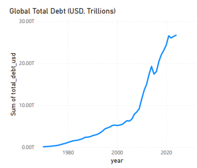
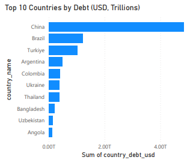
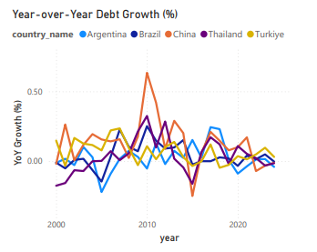
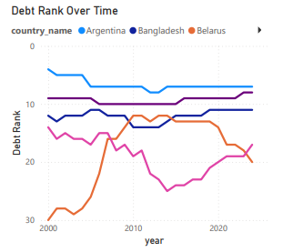
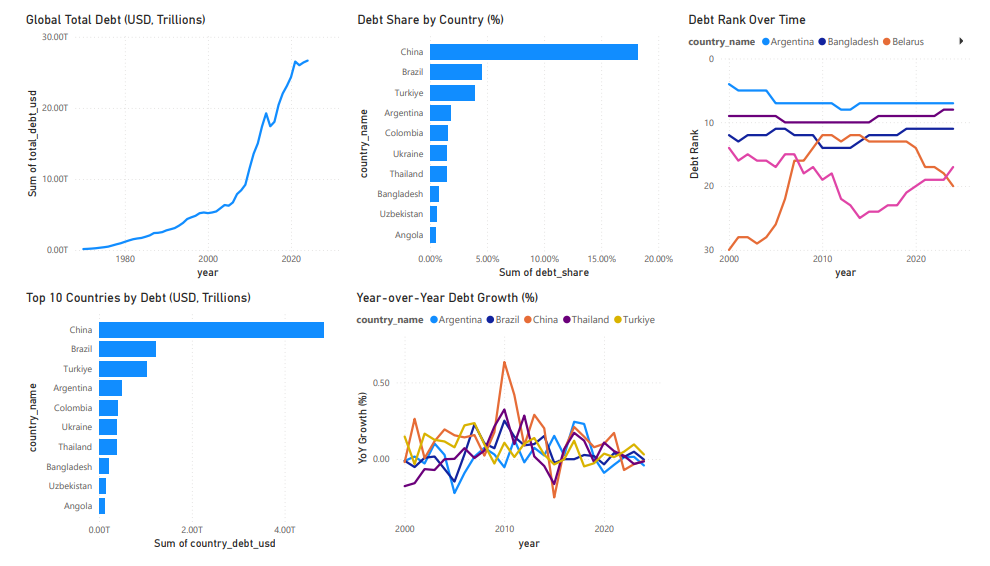

# International Debt Statistics  
Global External Debt Analysis (1970–2024)

## Overview
This project analyzes global external debt trends using the World Bank’s International Debt Statistics (IDS) dataset. The goal was to build a clean, reliable, and non-duplicative view of global external debt across countries over time and present the results in a clear, finance-oriented dashboard.

The analysis follows a full analytics pipeline:
PostgreSQL → SQL → Power BI → Static visuals for GitHub

---

## Why This Project
International debt datasets contain hierarchical reporting structures that can easily lead to double counting if not handled correctly. Without careful filtering, global debt totals can be overstated and trends become misleading.

This project focuses on:
- Enforcing a single source of truth for global debt
- Eliminating hierarchical double counting
- Producing clear, trustworthy macro-level insights

---

## Data Source
- World Bank – International Debt Statistics (IDS)
- Coverage: 1970–2024
- Currency: USD

### Key Data Decision
All analysis is strictly filtered to the following series:

DT.DOD.DECT.CD — Total External Debt Stock

This ensures:
- No overlap between subcategories
- Accurate global aggregation
- Consistent country-level comparisons

Once this filter was locked, all downstream tables and visuals were built from this single source of truth.

---

## Data Pipeline & Modeling
1. Raw IDS CSV files loaded into PostgreSQL  
2. Wide-format data unpivoted into long format  
3. Cleaned and validated yearly country totals  
4. Aggregated into Power BI–ready tables  

### Final SQL Tables
- ids.pb_total_debt_by_year  
- ids.pb_country_debt_by_year  
- ids.pb_country_debt_share  
- ids.pb_country_yoy_growth  
- ids.pb_country_rank_by_year  

All tables were validated for:
- Year coverage (1970–2024)
- Country consistency
- No hierarchical double counting

---

## Dashboard Visuals & Insights

### Global Total External Debt (USD, Trillions)

Global external debt has increased steadily over the last five decades, with sharper acceleration following major economic shocks and periods of global expansion.

---

### Top 10 Countries by External Debt

A small group of countries consistently dominates global external debt, highlighting concentration risk in international financial exposure.

---

### Share of Global Debt by Country

Global debt is unevenly distributed, with top contributors accounting for a disproportionately large share of total debt outstanding.

---

### Year-over-Year Debt Growth (%)

Debt growth rates fluctuate significantly over time, reflecting economic cycles, policy changes, and global financial disruptions.

---

### Debt Rank Over Time

Debt rankings show long-term structural shifts rather than short-term volatility, revealing persistent leaders in global debt accumulation.

---

### Full Dashboard View

---

## Countries Included in the Analysis
The following countries are included in the final dataset. This list is derived directly from the validated PostgreSQL aggregate tables used in Power BI and reflects reporting availability after filtering to Total External Debt Stock only.

Regional aggregates (e.g., South Asia, Sub-Saharan Africa) were excluded to ensure only country-level reporting entities are presented.

Afghanistan  
Albania  
Algeria  
Angola  
Argentina  
Armenia  
Azerbaijan  
Bangladesh  
Belarus  
Belize  
Benin  
Bhutan  
Bolivia  
Bosnia and Herzegovina  
Botswana  
Brazil  
Burkina Faso  
Burundi  
Cabo Verde  
Cameroon  
Central African Republic  
Chad  
China  
Colombia  
Comoros  
Congo, Dem. Rep.  
Congo, Rep.  
Cote d'Ivoire  
Djibouti  
Dominica  
Dominican Republic  
El Salvador  
Eswatini  
Rwanda  
Sao Tome and Principe  
Senegal  
Serbia  
Sierra Leone  
Solomon Islands  
Somalia, Fed. Rep.  
Sudan  
Suriname  
Syrian Arab Republic  

---

## Tools Used
- PostgreSQL
- SQL
- Power BI
- GitHub Pages (static images)

---

## Repository Structure
International_Debt_Statistics/
│
├── data_sql/
│   └── sql_scripts/
│       ├── 01_create_tables.sql
│       ├── 02_load_raw_files.sql
│       ├── 03_unpivot_to_long.sql
│       ├── 04_aggregations_for_powerbi.sql
│       ├── 05_fix_global_totals.sql
│       ├── 06_fix_country_totals.sql
│       └── 07_fix_totals_total_external_debt.sql
│
├── power_bi/
│   └── International_Debt_Statistics.pbix
│
├── visuals/
│   ├── global_total_debt.png
│   ├── top_10_countries_debt.png
│   ├── debt_share_by_country.png
│   ├── yoy_growth.png
│   ├── debt_rank_over_time.png
│   └── International_Debt_Statistics_Dashboard.png
│
└── README.md
