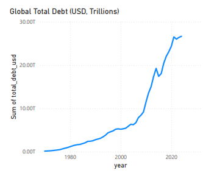
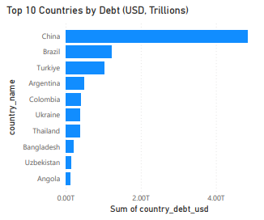
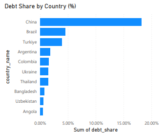
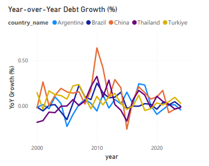
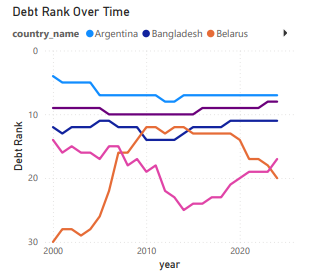
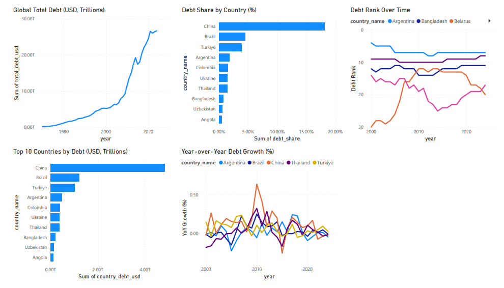

# International Debt Statistics — Global External Debt Analysis (1970–2024)

## Executive Summary

Sovereign external debt is a critical macro-financial risk indicator with implications for global stability, capital markets, and policy decision-making. This project analyzes global external debt trends using the World Bank’s International Debt Statistics (IDS) dataset, producing a clean, non-duplicative view of country-level external debt over time. The analysis emphasizes data integrity, eliminating hierarchical double counting to ensure reliable global aggregation and decision-ready macro insights.

**Scope (Locked):**
- Metric: Total External Debt Stock
- Coverage: 1970–2024
- Reporting level: Country-level only (no regional aggregates)
- Currency: USD
- Tools: PostgreSQL → SQL → Power BI → static visuals for GitHub

---

## Deliverables

- **PostgreSQL Data Pipeline:**  
  Cleaned, validated, non-duplicative debt tables

- **Power BI Dashboard:**  
  `power_bi/International_Debt_Statistics.pbix`

- **Executive Visuals:**  
  Stored in `International_Debt_Statistics/visuals/`

---

## Business Problem

International debt datasets contain hierarchical reporting structures that can easily lead to double counting when aggregating across countries and categories. Without strict controls, global debt totals can be overstated, distorting trend analysis and risk interpretation.

**Executive Question:**  
**How has global external debt evolved over time, and which countries contribute most to total debt exposure when measured using a consistent, non-duplicative framework?**

---

## Key Performance Indicators (KPIs)

- Global Total External Debt (USD)
- External Debt by Country
- Share of Global Debt by Country
- Year-over-Year Debt Growth (%)
- Country Debt Rank Over Time

---

## Data & Methodology

The analysis uses the World Bank IDS dataset and strictly filters all observations to a single series:

**DT.DOD.DECT.CD — Total External Debt Stock**

This constraint ensures:
- No overlap between subcategories
- Accurate global aggregation
- Consistent cross-country comparisons

Raw IDS files are loaded into PostgreSQL, unpivoted from wide to long format, cleaned, and validated. Aggregated tables are constructed specifically for Power BI consumption, with multiple validation checks to confirm year coverage, country consistency, and elimination of hierarchical duplication.

---

## Executive Dashboard & Visual Analysis

### Global Total External Debt (USD, Trillions)


Global external debt has increased steadily over the past five decades, with acceleration following major economic shocks and periods of global expansion.

---

### Top 10 Countries by External Debt


A small group of countries consistently dominates global external debt, highlighting concentration risk in international financial exposure.

---

### Share of Global Debt by Country


Debt exposure is unevenly distributed, with top contributors accounting for a disproportionate share of total outstanding debt.

---

### Year-over-Year Debt Growth (%)


Debt growth rates fluctuate significantly, reflecting economic cycles, policy shifts, and global financial disruptions.

---

### Debt Rank Over Time


Debt rankings reveal long-term structural positioning rather than short-term volatility, indicating persistent leaders in global debt accumulation.

---

### Full Dashboard View


---

## Countries Included

The final dataset includes only country-level reporting entities with valid Total External Debt Stock data. Regional aggregates were explicitly excluded to preserve analytical integrity.

*(Country list unchanged and derived directly from validated PostgreSQL tables.)*

---

## Key Findings

- Global external debt has risen materially over the last five decades.
- Debt concentration is high, with a small number of countries driving global totals.
- Growth rates vary significantly across time, reflecting macroeconomic shocks.
- Structural debt leadership remains relatively stable over long horizons.

---

## Recommendations

- Treat global debt aggregates with caution unless hierarchical duplication is explicitly controlled.
- Monitor concentration risk among top debtor countries.
- Use long-term trend analysis rather than short-term fluctuations for macro assessment.
- Apply similar filtering discipline to other multi-level international datasets.

---

## Next Steps (Write-Up Only)

- Extend analysis to debt-to-GDP and debt service ratios.
- Introduce regional roll-ups using controlled aggregation rules.
- Incorporate scenario analysis around global rate and growth shocks.
- Expand dashboard interactivity for comparative country analysis.

---

## Repository Structure

```text
International_Debt_Statistics/
│
├── data_sql/
│   └── sql_scripts/
│       ├── 01_create_tables.sql
│       ├── 02_load_raw_files.sql
│       ├── 03_unpivot_to_long.sql
│       ├── 04_aggregations_for_powerbi.sql
│       ├── 05_fix_global_totals.sql
│       ├── 06_fix_country_totals.sql
│       └── 07_fix_totals_total_external_debt.sql
│
├── power_bi/
│   └── International_Debt_Statistics.pbix
│
├── visuals/
│   ├── global_total_debt.png
│   ├── top_10_countries_debt.png
│   ├── debt_share_by_country.png
│   ├── yoy_growth.png
│   ├── debt_rank_over_time.png
│   └── International_Debt_Statistics_Dashboard.png
│
└── README.md
```
